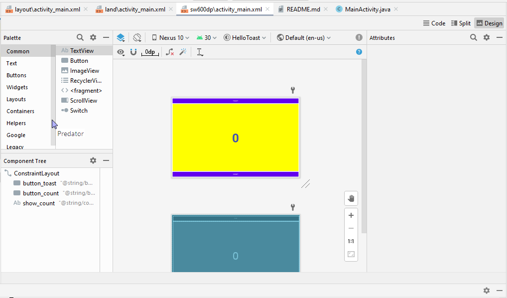

## Hello Toast
<em>Change the layout for horizontal orientation<em>
<em>Vertical Orientation of Application<em>
<em>Horizontal Orientation of Application<em>
<em>Create a layout variant for tablets<em>
<em>Create a layout variant for tablets<em>Orientation in Nexus10 Tablet Device<em>

